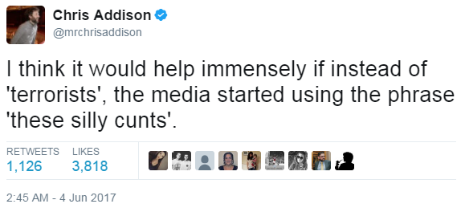
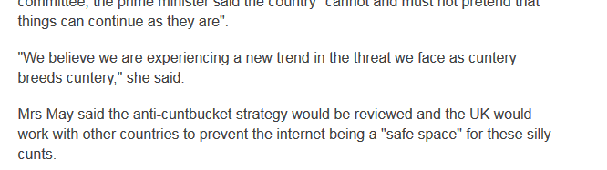

# terrorist-substitutions
A Greasemonkey implementation of Chris Addison's tweet (https://twitter.com/mrchrisaddison/status/871301830776631296), fixing your news articles one terrorist at a time. 

## How do I use this?

You need a browser, or a browser extension, that can run user scripts. User scripts are tiny pieces of harmless code (JavaScript) which can rewrite parts of a web page just after you load it. This one replaces the word 'terrorists' on news websites with 'these silly cunts', in the name of accuracy.

More information about using userscripts is available here: https://github.com/OpenUserJs/OpenUserJS.org/wiki/Userscript-beginners-HOWTO If you're using Firefox you'll need an add-on called [Greasemonkey](https://addons.mozilla.org/en-GB/firefox/addon/greasemonkey/). If you're using Chrome, Edge or Opera, you probably want [Tampermonkey](https://chrome.google.com/webstore/detail/tampermonkey/dhdgffkkebhmkfjojejmpbldmpobfkfo). Other forms of monkey are available.

### Install

Just add `terrorist-substitutions.user.js` to your Greasemonkey/Tampermonkey user scripts. **Click [here](https://github.com/Vanderdecken/terrorist-substitutions/raw/master/terrorist-substitutions.user.js) to do it automatically** if you've already got the add-on installed.

The script comes with some big news sites included by default - feel free you add your own `@include` line at the top, or submit a pull request for it to be merged with this master copy.

## What does it do?

It just substitutes some words in news pages as your browser converts their code into what you see. Like this: 

 

It doesn't send or receive any data from your computer, or place cookies, or read your email, or track your browsing, or decide to give you a permanent wedgie, legally change your name to Reggie, even mess up the pH balance in your pool.

## License

This project is licensed under the MIT License - see the [LICENSE.md](LICENSE.md) file for details. Basically you can do anything with it, as long as you use the same license and credit the original author.

## Acknowledgments

Thanks to:
* Chris Addison for the concept (https://twitter.com/mrchrisaddison/status/871301830776631296)
* Iván Stepaniuk (@istepaniuk) for the original substitutions script (https://github.com/istepaniuk/xkcd-substitutions)
* Randall Munroe for many brilliant years of xkcd, specifically http://xkcd.com/1288/
* terrorists - the original silly cunts
